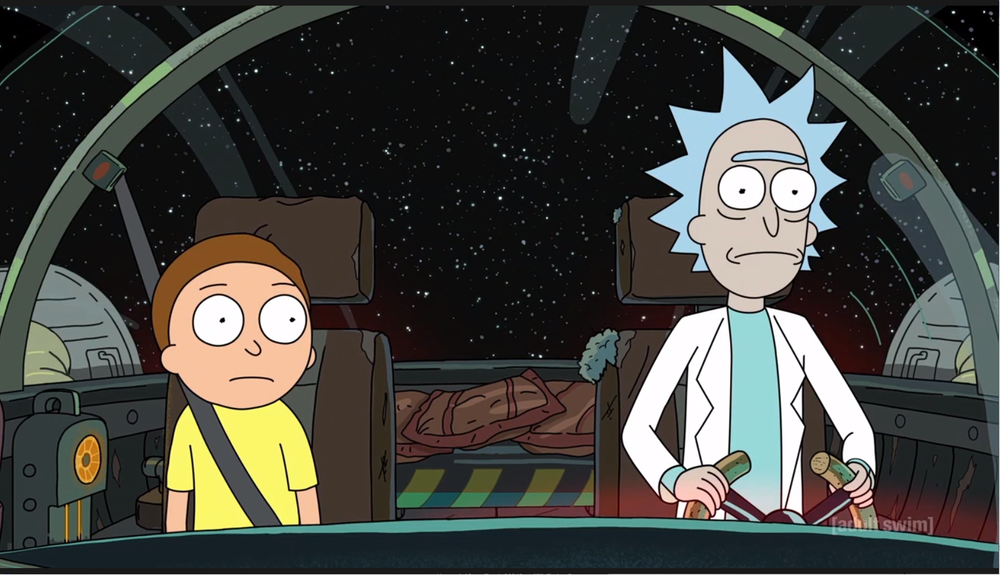

# :rocket: Notice

## :link: [Перейти на сайт](http://f1087222.xsph.ru/)
## :computer: Стэк
- **PHP**
- **SQL**
- **~~Laravel~~** 

#### Тестовое Laravel Middle

Нажмите, чтобы посмотреть подробности

#### Требования к проекту:

####  1. Развернуть новый проект на laravel. База данных MySql.

####  2. Работа с отрытым API - https://rickandmortyapi.com/documentation 
  
- Необходимо создать таблицы в БД, содержащие информацию о персонажах, существующих локациях и эпизодах

####  3. Прописать связи между таблицами. Между двумя таблицами использовать связь многие ко многим. С остальными связь по персонажу.

####  4. Реализовать сохранение данных из таблиц ДБ в Exel-документ через очереди и возможностью скачать этот документ. 
#### Содержимое excel-файла:
- Имя персонажа
- Статус
- Вид 
- Пол 
- Название локации 
- url локации
- Эпизоды, в которых снимался

#### 5. Реализовать в blade-шаблоне минимальный функционал для работы с данными: кнопка получить персонажей и вывести их количество, кнопка получить эпизоды и вывести их количество и кнопка сохранить документ и ссылка на скачивание документа

